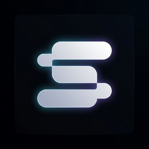

<div align="center">
  <br />
  

  <h3 align="center">Sahi Studio — استودیو سَهی</h3>

  <div>
    
    
    
    
  </div>

  <p align="center">A bilingual (English / فارسی) 3D studio site with full RTL support.</p>
</div>

## 📋 Table of Contents

1. [Introduction](#introduction)
2. [Tech Stack](#tech-stack)
3. [Features](#features)
4. [Quick Start](#quick-start)
5. [Internationalisation](#internationalisation)
6. [Project Structure](#project-structure)
7. [Scripts](#scripts)
8. [Deployment](#deployment)
9. [Credits](#credits)

## <a name="introduction">🤖 Introduction</a>

The website for **Sahi Studio**, a web and software studio. It pairs an interactive
Three.js scene with a fully translated interface: every string is available in English
and Persian, and switching language flips the whole document to RTL, swaps the type
family to Vazirmatn, and remembers the choice for the next visit.

The 3D foundation is based on [adrianhajdin/threejs-portfolio](https://github.com/adrianhajdin/threejs-portfolio)
(see [Credits](#credits)), rebuilt around a translation layer, studio branding and content
of its own.

## <a name="tech-stack">⚙️ Tech Stack</a>

- **React 18** + **Vite 5**
- **Three.js** via **React Three Fiber** and **Drei**
- **Tailwind CSS 3** (with the built-in `ltr:` / `rtl:` variants)
- **GSAP** for section animations
- **EmailJS** for the contact form
- **react-globe.gl** for the interactive globe
- **jsdom** + **esbuild** for the headless smoke test

## <a name="features">🔋 Features</a>

👉 **Bilingual by default** — English and Persian ship together; one click swaps every
string on the page, including project descriptions, testimonials and form placeholders.

👉 **Real RTL, not mirrored CSS** — the switch sets `<html dir>`, and layout uses
Tailwind's logical `ltr:` / `rtl:` variants so spacing, arrows and alerts flip correctly.

👉 **Persian typography** — Vazirmatn loads for Persian with adjusted line height, while
latin-only content (email addresses, form input) stays LTR inside RTL text.

👉 **Language memory** — the choice persists in `localStorage`; first-time visitors are
matched against their browser language.

👉 **Interactive 3D hero** — a hacker-room scene that reacts to cursor movement, plus a
3D project viewer and animated developer model.

👉 **Tested without a browser** — `npm test` checks translation parity, asset references
and renders the real React tree in jsdom to assert the language switch end to end.

## <a name="quick-start">🤸 Quick Start</a>

**Prerequisites:** [Git](https://git-scm.com/), [Node.js](https://nodejs.org/en) 18+, npm.

```bash
git clone https://github.com/SOHEILVAHDAN/scico.git
cd scico
npm install
npm run dev
```

Open [http://localhost:5173](http://localhost:5173).

### Contact form (optional)

The contact form uses [EmailJS](https://www.emailjs.com). Create a `.env` file in the
project root:

```env
VITE_APP_EMAILJS_SERVICE_ID=your_service_id
VITE_APP_EMAILJS_TEMPLATE_ID=your_template_id
VITE_APP_EMAILJS_PUBLIC_KEY=your_public_key
```

Without these the site runs fine — only form submission is disabled.

## <a name="internationalisation">🌍 Internationalisation</a>

All copy lives in `src/i18n/translations/`. Components never hardcode text; they read it
through the `useLanguage()` hook:

```jsx
import { useLanguage } from '../i18n/index.js';

const Section = () => {
  const { t, isRTL, language, toggleLanguage } = useLanguage();

  return <h2>{t.projects.heading}</h2>;
};
```

### Editing content

Change the studio's copy in **both** `translations/en.js` and `translations/fa.js` — the
two files must share the same key structure. `npm run check` fails the build if a key is
missing, extra or empty in one of them.

Assets, colours and layout values stay in `src/constants/index.js` and are merged with
the translated text at render time, so a project's video and logo are defined once and
described in every language.

### Adding a third language

1. Add `src/i18n/translations/<code>.js` with the same keys as `en.js`.
2. Register it in `src/i18n/config.js` (`translations` and `LANGUAGES`).
3. If the language is RTL, extend `getDirection()` in the same file.

`LanguageToggle` currently flips between two languages; with three or more, swap it for a
dropdown driven by the `LANGUAGES` array.

## <a name="project-structure">🗂️ Project Structure</a>

```
public/
  assets/            images, icons, studio logo
  models/            .glb / .fbx 3D models and animations
  textures/          project videos and surface textures
scripts/
  check-i18n.mjs     translation parity + asset reference check
  smoke-test.mjs     renders the app in jsdom and drives the language switch
  stub-loader.mjs    esbuild JSX transform + WebGL stubs for the test
src/
  components/        reusable UI and 3D components
  constants/         language independent data (assets, layout math)
  hooks/             useAlert
  i18n/
    config.js        language registry and resolution
    LanguageContext.js
    LanguageProvider.jsx
    translations/    en.js, fa.js
  sections/          Navbar, Hero, About, Projects, Clients, Experience, Contact, Footer
```

## <a name="scripts">📜 Scripts</a>

| Command | Description |
| --- | --- |
| `npm run dev` | Start the Vite dev server |
| `npm run build` | Production build into `dist/` |
| `npm run preview` | Serve the production build locally |
| `npm run lint` | ESLint across the project |
| `npm run check` | Verify translation parity and public asset references |
| `npm test` | `check` plus the jsdom smoke test of the language switch |

## <a name="deployment">🚀 Deployment</a>

The build output is a static site in `dist/`, deployable to Vercel, Netlify, GitHub Pages
or any static host.

```bash
npm run build
npm run preview   # verify locally first
```

On Vercel or Netlify: build command `npm run build`, publish directory `dist`. Remember to
add the `VITE_APP_EMAILJS_*` variables in the host's environment settings if you use the
contact form.

## <a name="credits">🙏 Credits</a>

The 3D scene, models and base layout come from the excellent
[**threejs-portfolio**](https://github.com/adrianhajdin/threejs-portfolio) tutorial project
by [Adrian Hajdin / JavaScript Mastery](https://www.youtube.com/@javascriptmastery). The
bilingual layer, RTL support, studio branding, content and test suite were added on top.
