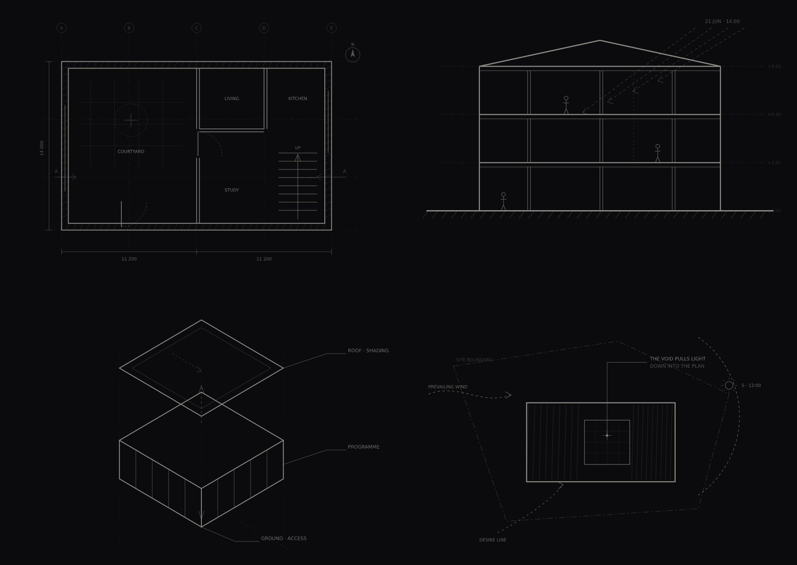

<div align="center">
  <br />
  <h3>Sahi Studio — استودیو سَهی</h3>
  <p><em>Architecture &amp; Spatial Design · معماری و طراحی فضا</em></p>

  <div>
    
    
    
    
  </div>

  <p align="center">A cinematic, bilingual portfolio where every project is explained by a drawing that builds itself as you scroll.</p>
</div>

## 📋 Table of Contents

1. [Introduction](#introduction)
2. [The idea](#idea)
3. [Tech Stack](#tech-stack)
4. [Features](#features)
5. [Quick Start](#quick-start)
6. [The drawings](#drawings)
7. [Internationalisation](#i18n)
8. [Project Structure](#structure)
9. [Scripts](#scripts)
10. [Accessibility & performance](#a11y)
11. [Deployment](#deployment)

## <a name="introduction">🤖 Introduction</a>

The portfolio of **Sahi Studio**, an architecture practice in Tehran. It is built
around one conviction: a building is best explained by the drawing that produced it,
not by a photograph of the finished object.

So the site has no photographs. Each project is presented as a technical drawing —
a plan, a section, an exploded axonometric, a concept diagram — that draws itself
stroke by stroke, in the order an architect would draw it, as the visitor scrolls
past the written argument for the building.

<div align="center">
  
  <p><sub>The four drawings, each of which builds itself stroke by stroke as you scroll.</sub></p>
</div>

## <a name="idea">✏️ The idea</a>

Every drawing is a real SVG with its strokes grouped into four layers that mirror
how a sheet is actually produced:

```
.sk-grid      setting-out grid, column bubbles      ← drawn first
.sk-walls     structure and poché
.sk-openings  doors, glazing, stairs, fittings
.sk-dims      dimensions, section marks, notes      ← drawn last
```

`DrawnSketch` measures each path, dashes it with its own length, then animates
`stroke-dashoffset` from that length to zero, staggered by layer and tied to scroll
position. The result is that the visitor draws the plan themselves by scrolling, and
the annotation only arrives once the geometry it describes exists.

That is the whole thesis of the site made mechanical: **you watch the thinking happen
before you see the conclusion.**

## <a name="tech-stack">⚙️ Tech Stack</a>

- **React 18** + **Vite 5**
- **GSAP** + **ScrollTrigger** — scrubbed draw-on, pinned sections, staggered reveals
- **Lenis** — momentum scrolling, driven from GSAP's ticker so pins never drift
- **Tailwind CSS 3** (utility layer) with a hand-written design-token stylesheet
- **jsdom** + **esbuild** — headless test suite, no browser required

No 3D, no image assets, no icon fonts. The entire visual identity is vector line work
and type, which is why the whole site is **~330 kB** (114 kB gzipped).

## <a name="features">🔋 Features</a>

👉 **Scroll-drawn architectural sketches** — four full technical drawings (773 individual
strokes) that build themselves in correct drawing order, scrubbed by scroll.

👉 **Pinned project plates** — on desktop the drawing sticks while the reasoning scrolls
past it, so argument and geometry are read together.

👉 **A pinned process stage** — one drawing frame that swaps its contents as the four
stages of the studio's method scroll through, with a progress rule that fills as you read.

👉 **Line-by-line masked type reveals** — headings rise out of their own baseline. Split on
words, not characters, so Persian letter-joining stays intact.

👉 **Manifesto that brightens as you read it** — each line lifts from 16% to full opacity as
it crosses the middle of the viewport.

👉 **Fully bilingual, genuinely RTL** — English and Persian, with `<html dir>` flipping,
logical CSS properties throughout, Vazirmatn for Persian, and latin-only content
(emails, sheet codes) held LTR inside RTL text.

👉 **Respects `prefers-reduced-motion`** — smooth scrolling is disabled and every
animation degrades to its final state.

## <a name="quick-start">🤸 Quick Start</a>

**Prerequisites:** [Git](https://git-scm.com/), [Node.js](https://nodejs.org/en) 18+, npm.

```bash
git clone https://github.com/SOHEILVAHDAN/scico.git
cd scico
npm install
npm run dev
```

Open [http://localhost:5173](http://localhost:5173).

### Contact form (optional)

The enquiry form uses [EmailJS](https://www.emailjs.com). Copy `.env.example` to `.env`:

```env
VITE_APP_EMAILJS_SERVICE_ID=your_service_id
VITE_APP_EMAILJS_TEMPLATE_ID=your_template_id
VITE_APP_EMAILJS_PUBLIC_KEY=your_public_key
```

Without these the site runs fine — only submission is disabled.

## <a name="drawings">📐 The drawings</a>

| Component | Drawing | Used for |
| --- | --- | --- |
| `SketchPlan` | Ground floor plan, 1:100 — poché walls, door swings, stair, courtyard, dimensions, section mark, north point | Courtyard House |
| `SketchSection` | Long section, 1:100 — ground line, slabs, columns, figures for scale, daylight study | Stone Library |
| `SketchAxo` | Exploded axonometric — roof, programme and ground pulled apart with leader annotations | Terraced Offices |
| `SketchConcept` | Concept diagram — site boundary, wind, sun path, desire line, and the single move | Desert Pavilion, hero, process |

To review a drawing on its own without running the site:

```bash
npm run sketches      # writes standalone SVGs to .sketch-preview/
```

### Adding a project

1. Write the copy in **both** `src/i18n/translations/en.js` and `fa.js` under `work.items`.
2. Add an entry to `projectAssets` in `src/constants/index.js` naming its sketch
   component, sheet number and scale.

To draw a new sketch, copy an existing one and keep the four `sk-*` layer groups —
`DrawnSketch` needs them to know the drawing order. Use `<text>` for annotation; text
cannot be dashed, so it is faded in after the geometry automatically.

## <a name="i18n">🌍 Internationalisation</a>

All prose lives in `src/i18n/translations/`. Components never hardcode text:

```jsx
import { useLanguage } from '../i18n/index.js';

const Section = () => {
  const { t, isRTL, language, toggleLanguage } = useLanguage();
  return <h2>{t.work.heading}</h2>;
};
```

The two translation files must share an identical key structure — `npm run check`
fails if a key is missing, extra or empty in either. Asset and layout data stays in
`src/constants/index.js` and is merged with the translated copy at render time.

**Adding a language:** add `translations/<code>.js`, register it in `src/i18n/config.js`,
and extend `getDirection()` if it is RTL.

## <a name="structure">🗂️ Project Structure</a>

```
scripts/
  check-i18n.mjs       translation parity + asset reference check
  smoke-test.mjs       renders the app in jsdom, drives the language switch
  stub-loader.mjs      esbuild JSX transform + GSAP/Lenis stubs
  render-sketches.mjs  exports drawings as standalone SVG
src/
  components/
    sketches/          the four architectural drawings
    DrawnSketch.jsx    scroll-scrubbed stroke-by-stroke draw-on
    RevealText.jsx     masked line-by-line type reveal
    FadeIn.jsx         quiet entrance for supporting blocks
    GrainOverlay.jsx   fixed paper grain
  hooks/
    useSmoothScroll.js Lenis wired into the GSAP ticker
    useReducedMotion.js
  i18n/                config, provider, en.js / fa.js
  sections/            Navbar, Hero, Manifesto, Work, Process, Studio, Contact, Footer
  index.css            design tokens + all component styles
```

## <a name="scripts">📜 Scripts</a>

| Command | Description |
| --- | --- |
| `npm run dev` | Vite dev server |
| `npm run build` | Production build into `dist/` |
| `npm run preview` | Serve the production build |
| `npm run lint` | ESLint across app and scripts |
| `npm run check` | Translation parity + asset references |
| `npm test` | `check` plus the jsdom smoke test (39 assertions) |
| `npm run sketches` | Export the drawings as standalone SVGs |

## <a name="a11y">♿ Accessibility & performance</a>

- Every animation checks `prefers-reduced-motion` and settles to its final state.
- Drawings are `aria-hidden` — they are illustration, and the argument beside them
  carries the meaning in text.
- Type reveals split on words, never characters, so screen readers and Persian
  letter-joining are unaffected.
- No web-font FOIT: system fallbacks are declared ahead of the loaded families.
- 330 kB total JS (114 kB gzipped), no images, no 3D runtime.

## <a name="deployment">🚀 Deployment</a>

Static output in `dist/` — deployable to Vercel, Netlify, GitHub Pages or any static host.

```bash
npm run build
npm run preview   # verify locally first
```

Build command `npm run build`, publish directory `dist`. Add the `VITE_APP_EMAILJS_*`
variables in your host's environment settings if you use the enquiry form.

---

<div align="center">
  <sub>The 3D scaffolding this project started from came from
  <a href="https://github.com/adrianhajdin/threejs-portfolio">adrianhajdin/threejs-portfolio</a>.
  Nothing of it remains: the drawings, motion system, content and architecture are the studio's own.</sub>
</div>
